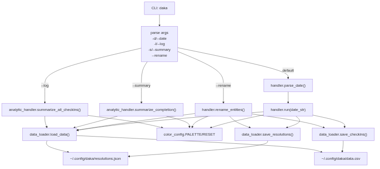

# daka 打卡

simple new year resolution tracker “daka 打卡”

## API Design



# 用户需求 Requirements

保姆级别的新年愿望打卡。

简单的用户输入：选单里用数字表示不同的项目(resolution)或者任务(task)，可以直接选择数字，也可以添加条目。
不输入数字代表添加条目。什么也不输入直接回车则返回上一页。

有两种数据，存储于`~/.config/daka/`
 - resolutions.json：保存项目细节。增加的项目会写进这个文件。
 - data.csv：保存打卡记录。打卡的项目会写进这个文件。

# 使用方法 Usage

1. 安装（开发模式）
```
python -m pip install -e . --user
```

2. 进入程序
```
daka -d <date> # default date is today's date
daka -l        # show raw check-in log and exit
daka --log     # show raw check-in log and exit
daka -s        # show yearly completion summary and exit
daka --summary # show yearly completion summary and exit
daka --rename  # rename a resolution or task and exit
```

3. CLI 选项说明
- `-d, --date <YYYY-MM-DD>`：指定打卡日期；不传则使用今天。
- `-l, --log`：显示所有历史打卡日志并退出。
- `-s, --summary`：显示年度完成率汇总并退出：
  - day: `打卡天数 / 当年总天数`
  - week: `有打卡的周数 / 当年总周数`
- `--rename`：进入重命名工具，可重命名 resolution 或 task，并保存后退出。

4. 选择打卡项目或者增加项目（resolution）

5. 选择具体任务或者增加任务（task）

# Validation and testing plan

## User input

 - Incorrect date format
 - when task name starts with q, daka recognizes it as a valid task instead of "quit"
 - The same combination of (resolution, task) should not be checked in on the same date

## Data handling

 - All tasks/resolutions checked in are under resolutions.json. There should be no task that is only in data.csv.
 - Color-coding of the main cli is the same as the log/summary views `daka -l` / `daka --log` / `daka -s`.
 - The ordering of resolutions/tasks is consistent among all APIs.

## User action

 - When a user renames a task/resolution, both resolutions.json and data.csv should be updated

## Analytics

 - daka -l shows all history correctly
 - Calculation of the checkins is correct
 - Percentage of completion is correct:
   - day: `checkin_days_in_year / days_in_year`
   - week: `weeks_with_checkin / weeks_in_year`
